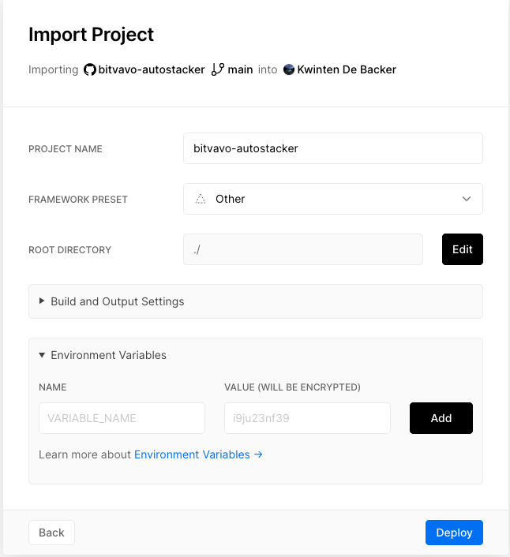

# Bitvavo autostacker

Ever since the unfortunate exit of [Bittr](https://getbittr.com/) people have been unable to stack sats in an automated way using a Dutch platform.

This software makes it easy to autostack bitcoin on the [Bitvavo](https://bitvavo.com) platform.
The software is completely self-hosted using Github, [Vercel](https://vercel.com) and [IFTTT](https://ifttt.com)

# What does this do
This app checks every day (or whenever you want) if you have euro's available in your Bitvavo account.
If you don't nothing happens. If you do, the app uses every euro in your account to market buy Bitcoin.
This way, you can setup a reccuring payment from your bank account. As soon as the money arrives at your Bitvavo account, Bitcoin
will be bought with it. You will receive e-mail confirmations from Bitvavo notifying you that the buy has taken place.
The app does not (at the moment) withdraw bitcoin to your personal wallet.

The app should be hosted by Vercel, and we use [If This then That](https://ifttt.com) to poll the app every x amount of time.
All this is hosted for free (Vercel is a serverless platform).

# Step by step

- Create a [Bitvavo](https://bitvavo.com) account.
- Make sure your account is fully verified:
    - Upload your ID
    - Verify your phone number
    - Deposit some euro's
    - Add 2FA to your account
- Create a Github account
- Fork this repository (that's the button at the top right of this page)
- Create a [Vercel](https://vercel.com) account. You can use your Github account to do this. Vercel is needed to host this software.
- Create a new project on Vercel from this repository that you have just forked.
- You will be prompted to add environment variables. Keep this window open.
- Create an API key that can _View information_ and _Trade_, but *not* withdraw. (This is a safety measure. This software does not (yet) support withdrawals)
    - In Vercel, add the environment variables `CONFIG_APIKEY` -> your Bitvavo API *key* (See below screenshot)
    - In Vercel, add the environment variables `CONFIG_APISECRET` -> your Bitvavo API *secret*
    - Deploy the Vercel app
- Now, every time someone visits the URL `https://bitvavo-autostacker.<yourname>.vercel.app/api/buy`, the app will check if it can buy bitcoin, and then actually buy it if it can.
- Now we only need to make sure this URL is triggered from time to time. You need to create an [IFTTT](https://ifttt.com) account first.
- Then, Click `Create`
    - Search for "Time" and add the `Date & Time` module as the first step.
    - Create a trigger for "every day at" and specify a time you want it to trigger. Maybe make this time a little bit later than the time your outgoing transfer
    takes place from your bank account. If your bank transfer is not instant, they are usually processed between 09:00 and 10:00 AM, so maybe set the time to 10:00 AM.
    - For the second stage, search for `Webhooks`
    - For url, fill in the url of your Vercel app: eg. `https://bitvavo-autostacker.<yourname>.vercel.app/api/buy`
    - Select `application/json` for content type
    - Click `Create` , `Continue`, and then `Finish`
- Everything should work well. Make sure to have some euro's in your Bitvavo account to test it out.
